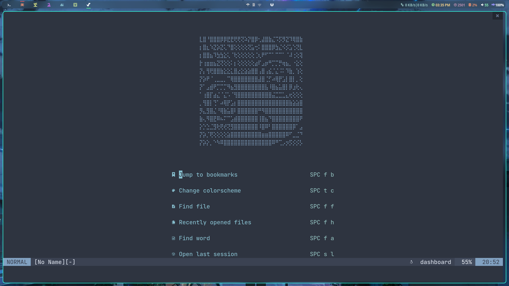
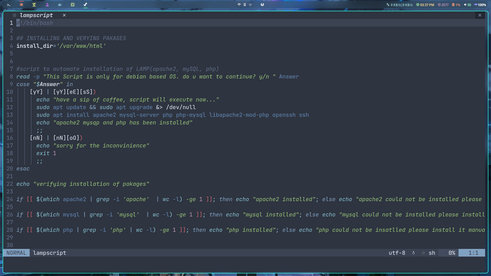
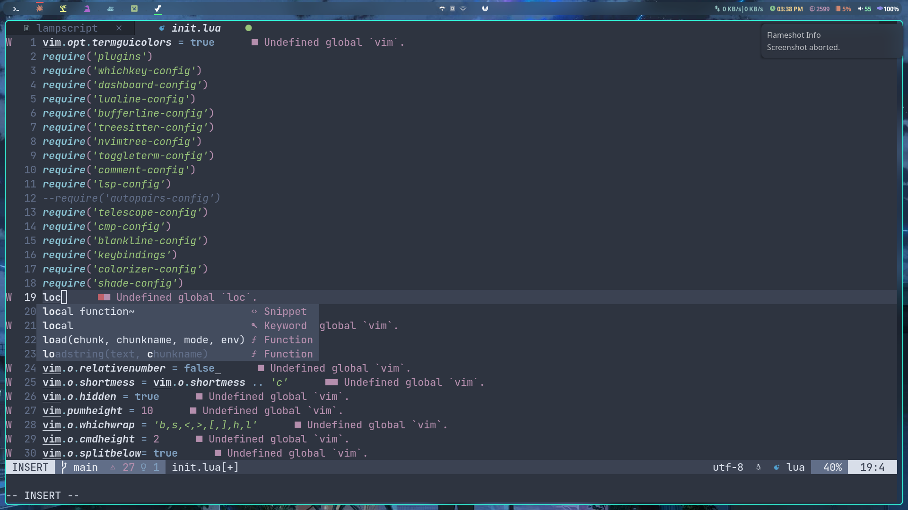
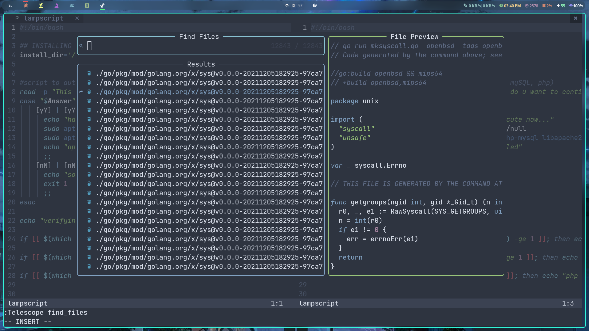
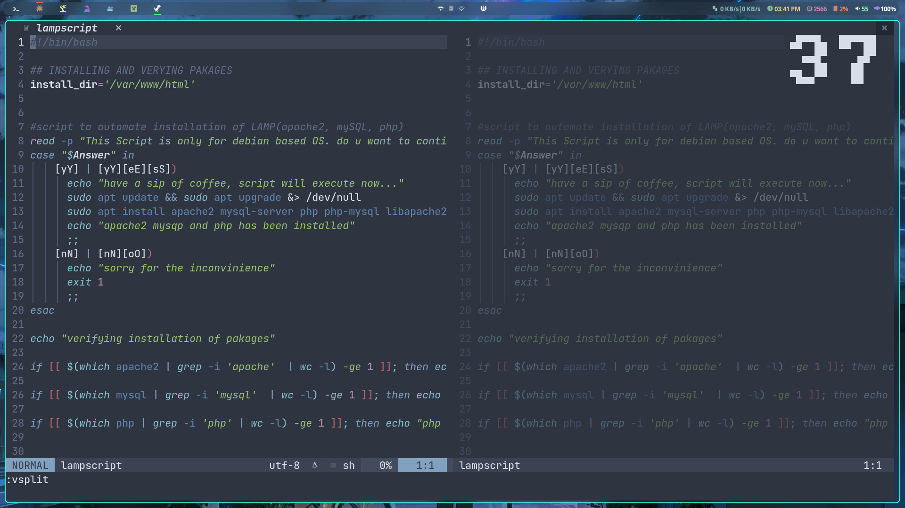

## nvim

```
autopair
blankline
bufferline
cmp
colorizer
comment
dashboard
keybindings
lsp
lualine
nvimtree
shade
telescope
toggleterm
treesitter
whichkey
```

## feature
- autocompletion and indentation 
- brightness controll for diff splits
- syntax highlighting
- telescope finder
- nvim tree file manager
- a dashboard
- tabs(buffers) on top
- etc 

just do  `:PackerSync` after copying the configs
and setup lsp `:LspInstall` inside some language file and select the option ,after that u will get a prompt and can select all the languages from there 
just by selsecting the line and press i.


# screenshots







